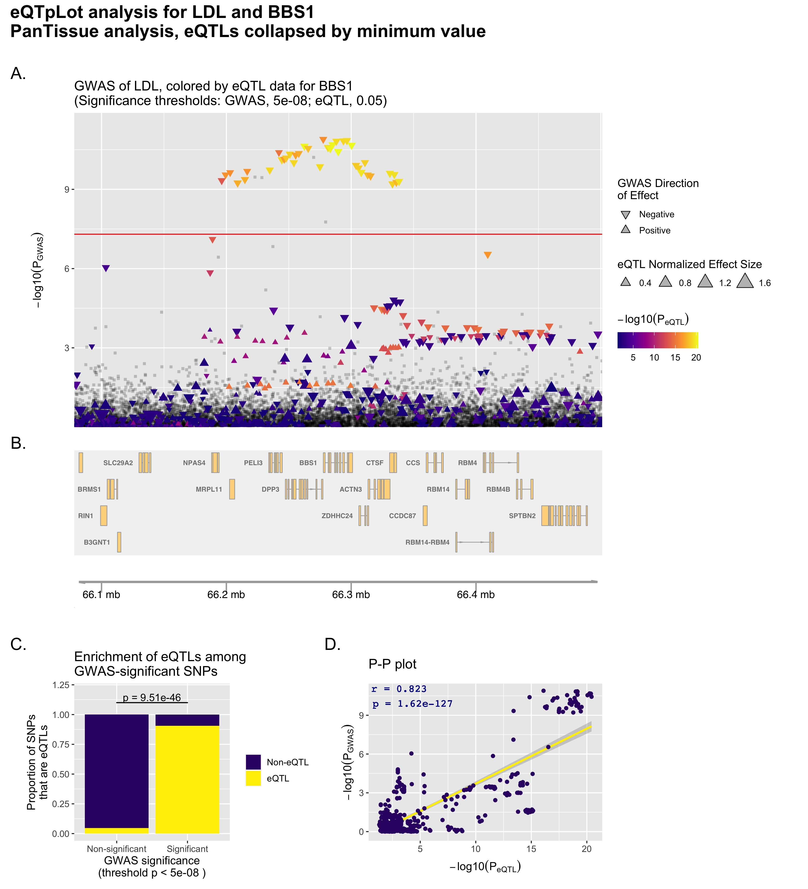
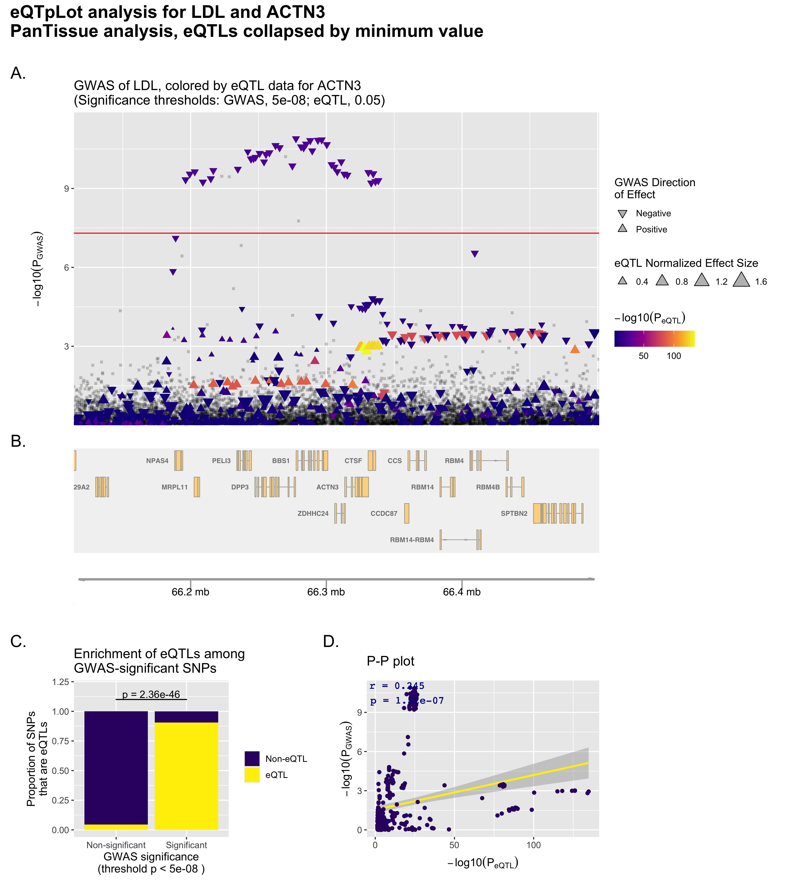

# eQTpLot

## Visualization of Colocalization Between eQTL and GWAS Data
eQTpLot is an intuitive and user-friendly R package developed for the visualization of colocalization between eQTL and GWAS data. eQTpLot takes as input standard GWAS and eQTL summary statistics, and optional pairwise LD information, to generate a series of plots visualizing colocalization, correlation, and enrichment between eQTL and GWAS signals for a given gene-trait pair. With eQTpLot, investigators can easily generate a series of customizable plots clearly illustrating, for a given gene-trait pair: 1) colocalization between GWAS and eQTL signals, 2) correlation between GWAS and eQTL p-values, 3) enrichment of eQTLs among trait-significant variants, 4) the LD landscape of the locus in question, and 5) the relationship between the direction of effect of eQTL signals and the direction of effect of colocalizing GWAS peaks. These clear and comprehensive plots provide a unique view of eQTL-GWAS colocalization, allowing for a more complete understanding of the interaction between gene expression and trait associations. eQTpLot was developed in R version 4.0.0 and depends on a number of packages for various aspects of its implementation (biomaRt, dplyr, GenomicRanges, ggnewscale, ggplot2, ggplotify, ggpubr, gridExtra, Gviz, LDheatmap, patchwork). We have made eQTpLot freely available for use at the command line or in any R-based integrated development environment, such as RStudio. 

&nbsp;

&nbsp;

## Installation

eQTpLot can be install using `devtools`, either directly from GitHub,

`devtools::install_github("RitchieLab/eQTpLot")`

or by downloading the repository to your computer, unzipping, and installing the `eQTpLot` folder.

`devtools::install("eQTpLot")`

*Note: For issues installing dependencies, try running the following code prior to installation.

`Sys.setenv(R_REMOTES_NO_ERRORS_FROM_WARNINGS=TRUE)`

&nbsp;

&nbsp;

## Input files
At a minimum, eQTpLot requires two input files, imported into R as data frames: one of GWAS summary statistics (as might be obtained from a standard associations study as completed in PLINK) and one of eQTL summary statistics (as might be downloaded directly from the GTEx portal at gtexportal.org). Two optional data frames may also be supplied -- one of pairwise linkage disequilibrium (LD) data for the analyzed variants, and the other of gene coordinates. The formatting parameters of all both required and both optional input files are summarizes here.

#### GWAS.df
`GWAS.df` is a data frame of GWAS summary data, with one row per SNP, with columns as one might obtain from a genome-wide association study performed in PLINK using either the --logistic or --linear flags. `GWAS.df` should contain the following columns:

**Column**|**Description**
-----|:-----
  `CHR`|Chromosome for SNP (sex chromosomes coded numerically). Data type: integer
  `POS`|Chromosomal position for each SNP, in base pairs. Data type: integer
  `SNP`|Variant ID (such as dbSNP ID "rs...". *Note: Must be the same naming scheme as used in `eQTL.df` to ensure proper matching).* Data type: character  
  `P`|p-value for the SNP from GWAS analysis. Data type: numeric 
  `BETA`|beta for the SNP from GWAS analysis. Data type: numeric 
  `PHE`|*OPTIONAL* Name of the phenotype for which the GWAS data refers. This column is optional and is useful if your `GWAS.df` contains data for multiple phenotypes, such as one might obtain from a PheWAS. If `GWAS.df` does not contain a `PHE` column, eQTpLot will assume all the supplied GWAS data is for a single phenotype, with a name to be specified with the `trait` argument. Data type: character 

**Example GWAS.df:**

   CHR|POS|SNP|BETA|P|PHE
-----|-----|-----|-----|-----|-----
   14|88500045|rs17123978|0.000479064|0.227412|eGFR
   14|88500645|rs60623686|0.000118531|0.256264|eGFR

&nbsp;

#### eQTL.df
`eQTL.df` is a data frame of eQTL data, one row per SNP, with columns as one might download directly from the GTEx Portal in .csv format. `eQTL.df` should contain the following columns:

**Column**|**Description**
-----|:-----
  `SNP.Id`|Variant ID (such as dbSNP ID "rs...".*Note: naming scheme must be the same as what is used in the `GWAS.df` to ensure proper matching.* Data type: character
  `Gene.Symbol`|Gene symbol to which the eQTL expression data refers *Note: gene symbol must match entries in `Genes.df` to ensure proper matching.* Data type: character
  `P.value`|P-value for the SNP from eQTL analysis Data type: numeric  
  `NES`|Normalized effect size for the SNP from eQTL analysis (Per GTEx, defined as the slope of the linear regression, and is computed as the effect of the alternative allele relative to the reference allele in the human genome reference. Data type: numeric 
  `Tissue`|Tissue type to which the eQTL p-value/NES refer *Note: eQTL.df can contain multiple tissue types.* Data type: character
  `N`|*OPTIONAL* The number of samples used to calculate the p-value and NES for the eQTL data. This value is used if performing a MultiTissue or PanTissue analysis with the option CollapseMethod set to "meta" for a simple sample size weighted meta-analysis. Data type: character

**Example eQTL.df:**

   Gene.Symbol|SNP.Id|P.value|NES|Tissue
-----|-----|-----|-----|-----
  PTPN21|rs147470573|0.0479617|-0.156095|Adipose_Subcutaneous
  PTPN21|rs60688436|0.0479617|-0.156095|Adipose_Subcutaneous
  

&nbsp;

#### Genes.df
`Genes.df` is an optional data frame, one row per gene, which should contain the following columns: *Note: eQTpLot automatically loads a default `Genes.df` containing information for most protein-coding genes for genome builds hg19 and hg38, but you may wish to specify our own `Genes.df` data frame if your gene of interest is not included in the default data frame, or if your eQTL data uses a different gene naming scheme (for example, Gencode ID instead of gene symbol)*

**Column**|**Description**
-----|:-----
`Gene`|Gene symbol/name for which the Coordinate data refers to *Note: gene symbol/name must match entries in `eQTL.df` to ensure proper matching.* Data type: character
`CHR`|Chromosome the gene is on *Note: do not include a "car" prefix, and sex chromosomes should be coded numerically.* Data type: integer
`Start`|Chromosomal coordinate of start position (in basepairs) to use for gene *Note: this should be the smaller of the two values between `Start` and `Stop`.* Data type: integer
`Stop`|Chromosomal coordinate of end position (in basepairs) to use for gene *Note: this should be the larger of the two values between `Start` and `Stop`.* Data type: integer  
`Build`|The genome build (either hg19 or hg38) for the coordinate data -- the default `Genes.df` dataframe contains entries for both genome builds for each gene, and the script will select the appropriate entry based on the specified `gbuild` (default is hg19)). Data type: character, either "hg19" or "hg38"

**Example Genes.df:**

   Gene|CHR|Start|Stop|Build
-----|-----|-----|-----|-----
  EML5|14|89078491|89259096|hg19
  KCNK10|14|88646451|88793256|hg19

&nbsp;

#### LD.df
`LD.df` is an optional data frame of SNP linkage data, one row per SNP pair, with columns as one might obtain from a PLINK linkage disequilibrium analysis using the PLINK --r2 option. *Note: If no `LD.df` is supplied, eQTpLot will plot data without LD information*

**Column**|**Description**
-----|:-----
`BP_A`|Base pair position of the first variant in the LD pair. Data type: integer	
`SNP_A`|Variant ID of the first variant in the LD pair *Note: only variants that also appear in the `GWAS.df` SNP column will be used for LD analysis.* Data type: character	
`BP_B`|Base pair position of the second variant in the LD pair. Data type:integer
`SNP_B`|Variant ID of the second variant in the LD pair *Note: only SNPs that also appear in the `GWAS.df` SNP column will be used for LD analysis.* Data type: character
`R2`|Squared correlation measure of linkage between the two variants. Data type: numeric

**Example LD.df:**

   BP_A|SNP_A|BP_B|SNP_B|R2
-----|-----|-----|-----|-----|
66078129|rs162559|66079275|11:66079275_GA_G|0.29955
66078129|rs1625595|66079361|rs33981819|0.686453

&nbsp;

&nbsp;

   

## Function arguments
To run `eQTpLot`, a number of arguments must be specified. A number of optional arguments are available as well to customize and adjust the resultant plots.

**Required Arguments**

Argument|Description
-----|-----
`eQTL.df`|A data frame of eQTL summary statistic data, as defined above
`GWAS.df`|A data frame of GWAS summary statistic data, as defined above
`gbuild`|**Default value is “hg19”**. The genome build, in quotes, to use for fetching genomic information for the genome track (panel B). This build should match the genome build used for `CHR` and `BP` in the `GWAS.df`. Currently the only compatible options are “hg19” and “hg38”
`gene`|name/symbol of the gene to analyze, in quotes *Note: gene name must match an entry in `Genes.df` for the specified gbuild*
`sigpvalue_eQTL`|**Default value is 0.05**. The significance threshold to use for eQTL data (variants with an eQTL p-value larger than this threshold will be excluded from the analysis)
`sigpvalue_GWAS`|**Default value is 5e-8**. The significance threshold to use for GWAS data (this value will be used for a horizontal line in plot A, and to define GWAS significant/non-significant variants for the eQTL enrichment plot). 
`tissue`|**Default value is “all”**. The tissue name, in quotes, to use for analysis. `eQTL.df` entries will be filtered to contain only data on this tissue. If this parameter is set to “all”, eQTpLot will pick the smallest eQTL p-value for each SNP across all tissues for a PanTissue analysis (described in more detail below). Alternatively, a list of tissue names can be supplied (in the format c(“tissue1”, “tissue2”, …) to perform a MultiTissue analysis on just these tissues. *Note: the tissue name must match at least one entry in the `eQTL.df` `Tissue` column*
`trait`|name of the GWAS phenotype to analyze, in quotes. If all the data in `GWAS.df` is for a single phenotype and no `PHE` column is present, this argument will be used as the name for the analyzed phenotype. If `GWAS.df` contains information on multiple phenotypes, as specified in the optional `GWAS.df` `PHE` column, this parameter will be used to filter in `GWAS.df` entries for only this phenotype.

&nbsp;

**Optional Arguments**

Argument|Description
-----|-----
`Genes.df`|A data frame of gene coordinates, as defined above
`LD.df`|A data frame of pairwise linkage data, as defined above
`congruence`|**Default value is FALSE**. If set to TRUE, variants with congruent and incongruent effects will be plotted separately, as described below. 
`genometrackheight`|**Default value is 2**. Used to set the height of the genome track panel (B). Gene-dense regions may require more plotting space, whereas gene-sparse regions may look better with less plotting space.
`getplot`|**Default value is TRUE**. If set to FALSE, eQTpLot will not display the generated plot in the viewport.
`LDcolor`|Only used if `LD.df` is supplied. **Default value is “color”**. For the LDheatmap panel, the heatmap will be filled using a grayscale palate if this argument is set to “black”, or with a full color palate if this argument is set to “color”.
`LDmin`|Only used if `LD.df` is supplied. **Default value is 10**. For the LDheatmap panel, only variants that are in LD (with R2 > `R2min`) with at least this many other variants will be displayed. This parameter can be useful to thin the number of variants being plotted in the LDheatmap.
`leadSNP`|Only used if `LD.df` is supplied. This parameter is used to specify the lead SNP ID, in quotes, to use for plotting LD information in the P-P plots. The specified variant must be present in both the `GWAS.df` and `LD.df` data frames.
`NESeQTLRange`|the maximum and minimum limits in the format c(min,max), to display for the `NES` value in `eQTL.df`. The default setting will adjust the size scale automatically to fit the displayed data, whereas specifying the limits will keep them consistent between plots.
`R2min`|Only used if `LD.df` is supplied. **Default value is 0.1**. The threshold for R2 to use when selecting LD data from `LD.df`. Variant pairs with R2 < `R2min` will not be included in the analysis.
`range`|**Default value is 200**. The range, in kB, to extend the analysis window on either side of the gene of interest, as defined by the `Start` and `Stop` points for the specified `gene` in `Genes.df`.
`res`|**Default value is 300**. The resolution, in dpi, for the output plot image 
`saveplot`|**Default value is TRUE**. If set to TRUE, eQTpLot will save the generated plot in the working directory with the name "`gene`.`trait`.`tissue`.Congreunce_Info.LD_Info.eQTpLot.png", using the variables and arguments provided to generate the plot.
`wi`|**Default value is 12 if `LD.df` is not supplied, 14 if `LD.df` is supplied**. The width of the output plot image, in inches. The height of the plot is calculated from this argument as well to maintain the appropriate aspect ratio.
`xlimd`|used to manually adjust the x axis maximum for the P-P plot, if needed
`ylima`|used to manually adjust the y axis maximum in plot A, if needed
`ylimd`|used to manually adjust the y axis maximum for the P-P plot, if needed
`CollapsMethod`|**Default value is “min”**. This parameter dictates the method used to collapse eQTL p-values and NES across tissues if a MultiTissue or PanTissue analysis is specified. If set to "min” the p-value and NES from the tissue with the smallest p-value for each variant will be selected. If set to "median" or "mean" the median or mean p-value and NES for each variant, across all specified tissues, will be selected. If set to “meta” eQTpLot will perform a simple sample-size-weighted meta-analysis of the p-values across all specified tissues. *NOTE: If "meta" is specified, `eQTL.df` should include a column with header "N" indicating the number of samples used to derive the given eQTL data. If no column N is present, eQTpLot will give the user the option to complete a meta-analysis assuming equal sample sizes for all tissues, which may lead to inaccurate results. Also note that if "meta" is specified, no meta-analyzed NES will be computed, and all variants will be displayed as the same size in the main eQTpLot figure.*
`Gene.List`| **Default value is FALSE**. If set to TRUE, this parameter will output the Pearson correlation between eQTL and GWAS p-values for a given tissue across a user-supplied list of genes, ordered by significance. No plots will be generated. If the user sets the parameter tissue to “all,” or to a list of tissues, eQTpLot will collapse the eQTL data for these tissues by variant, using the method specified by the parameter `CollapseMethod`. This may be a useful parameter to obtain a very simple bird’s-eye view of the genes at a locus whose expression is most closely correlated to a relevant GWAS signal for a given trait.
`Tissue.List`|**Default value is FALSE**. If set to TRUE, this parameter will output the Pearson correlation between eQTL and GWAS p-values for a given gene across a user-supplied list of tissues, ordered by significance. No plots will be generated. If the user sets the parameter tissue to “all,” eQTpLot will consider each tissue included in `eQTL.df`. This may be a useful parameter to obtain a very simple bird’s-eye view of the tissues in which a given gene’s expression is most closely tied to a relevant GWAS signal for a given trait.

&nbsp;

&nbsp;

## Notes on Analysis

In its simplest implementation, eQTplot takes as input two data frames, one of GWAS summary data and the other of eQTL summary data, with the user specifying the name of the gene to be analyzed, the GWAS trait to be analyzed (useful if the GWAS data contains information on multiple associations, as one might obtain from a Phenome-wide Association Study (PheWAS)), and the tissue type to use for the eQTL analysis. Using these inputs, eQTpLot generates a series of plots intuitively illustrating the colocalization of GWAS and eQTL signals in chromosomal space, and the enrichment of and correlation between the candidate gene eQTLs and trait-significant variants. Additional parameters and data can be supplied, such as pairwise variant LD information, allowing for an even more comprehensive visualization of the interaction between eQTL and GWAS data within a given genomic locus.

#### Congruence/Incongruence
One major implementation feature of eQTpLot is the option to divide eQTL/GWAS variants into two groups based on their directions of effect. If the argument `congruence` is set to TRUE, all variants are divided into two groups: congruous, or those with the same direction of effect on gene expression and the GWAS trait (e.g., a variant that is associated with increased expression of the candidate gene and an increase in the GWAS trait), and incongruous, or those with opposite directions of effect on gene expression and the GWAS trait (e.g., a variant that is associated with increased expression of the candidate gene but a decrease in the GWAS trait). The division between congruous and incongruous variants provides a more nuanced view of the relationship between gene expression level and GWAS associations – a variant associated with increased expression of a candidate gene and an increase in a given GWAS trait would seem to be operating through different mechanisms that a variant that is similarly associated with increased expression of the same candidate gene, but a decrease in the same GWAS trait. eQTpLot intuitively visualizes these differences as described below. This distinction also serves to illuminate important underlying biologic difference between different gene-trait pairs, discriminating between genes that appear to suppress a particular phenotype and those that appear to promote it.

#### PanTissue and MultiTissue Analysis
In some instances, it may be of interest to visualize a variant’s effect on candidate gene expression across multiple tissue types, or even across all tissues. Such analyses can be accomplished by setting the argument `tissue` to a list of tissues contained within `eQTL.df` *(e.g. c(“Adipose_Subcutaneous”, “Adipose_Visceral”))* for a MultiTissue analysis, or by setting the argument `tissue` to “all” for a PanTissue analysis. In a PanTissue analysis, eQTL data across all tissues contained in `eQTL.df` will be collapsed, by variant, into a single pan-tissue eQTL; a similar approach is used in a MultiTissue analysis, but in this case eQTL data will be collapsed, by variant, across only the specified tissues. The method by which eQTpLot collapses eQTL data can be specified with the argument `CollapseMethod`, which accepts as input one of four options – “min,” “median,” “mean,” or “meta.” By setting `CollapseMethod` to “min” (the default), for each variant the tissue with the smallest eQTL p-value will be selected, such that each variant’s most significant eQTL effect, agnostic of tissue, can be visualized. Setting the parameter to “median” or “mean” will visualize the median or mean p-value and NES value for each SNP across all specified tissues. Lastly, setting `CollapseMethod` to “meta” will perform a simple sample-size-weighted meta-analysis *(i.e. a weighted Z-test)* for each variant across all specified tissues, visualizing the resultant p-value for each variant. It should be noted that this meta-analysis method requires a sample size for each eQTL entry in `eQTL.df`, which should be supplied in an optional column “N.” If sample size numbers are not readily available *(as may be the case if directly downloading cis-eQTL data from the GTEx portal)*, eQTpLot gives the user the option to presume that all eQTL data is derived from identical sample sizes across all tissues – this approach may of course yield inaccurate estimates of a variant’s effect in meta-analysis, but may be useful to the user.

&nbsp;

&nbsp;

## Generation of Each Panel

#### Generation of the main eQTL-GWAS Colocalization Plot
To generate the main eQTL-GWAS Colocalization Plot (Figures 1A, 2A, 3A, 4A), a locus of interest (LOI) is defined to include the target gene’s chromosomal coordinates (as listed in `Genes.df`, for the indicated `gbuild`, for the user-specified `gene`), along with a range of flanking genome (specified with the argument `range`, with a default value of 200 kilobases on either side of the gene). GWAS summary statistics from `GWAS.df` are filtered to include only variants that fall within the LOI. The variants are then plotted in chromosomal space along the horizontal axis, with the inverse log of the p-value of association with the specified GWAS trait (PGWAS) plotted along the vertical axis, as one would plot a standard GWAS Manhattan plot. The GWAS significance threshold, `sigpvalue_GWAS` (default value 5e-8), is depicted with a red horizontal line.

Within this plot, variants that lack eQTL data for the target gene in `eQTL.df` (or for which the eQTL p-value (PeQTL) does not meet the specified significance threshold, `sigpvalue_eQTL` (default value 0.05)) are plotted as grey squares. On the other hand, variants that act as eQTLs for the target gene (withPeQTL < `sigpvalue_eQTL`) are plotted as colored triangles, with a color gradient corresponding to the inverse magnitude ofPeQTL. As noted above, an analysis can be specified to differentiate between variants with congruous versus incongruous effects on the GWAS trait and candidate gene expression levels – if this is the case, variants with congruous effects will be plotted using a blue color scale, while variants with incongruous effects will be plotted using a red color scale (as seen in Figure 4A).The size of each triangle corresponds to the eQTL normalized effect size (NES) for each variant, while the directionality of each triangle is set to correspond to the direction of effect for the variant on the GWAS trait. 

A depiction of the genomic positions of all genes within the LOI is generated below the plot using the package Gviz (Figures 1B, 2B, 3B, 4B). If LD data is supplied, in the form of `LD.df`, a third panel illustrating the LD landscape of eQTL variants within the LOI is generated using the package LDheatmap (Figure 3C, 4C). To generate this panel, `LD.df` is filtered to contain only eQTL variants that appear in the plotted LOI, and to include only variant pairs that are in LD with each other with R2 > `R2min` (default value of 0.1). This dataset is further filtered to include only variants that are in LD (with R2 > `R2min`) with at least a certain number of other variants (user-defined with the argument `LDmin`, default value of 10). These filtering steps are useful in paring down the number of variants to be plotted in the LDheatmap, keeping the most informative variants and reducing the time needed to generate the eQTpLot. A heatmap illustrating the pairwise linkage disequilibrium of the final filtered variant set is subsequently generated below the main eQTL-GWAS Colocalization Plot, with a fill scale corresponding to R2 for each variant pair. The location of each variant in chromosomal space is indicated at the top of the heatmap, using the same chromosomal coordinates as displayed in panels A and B.  

#### Generation of the eQTL Enrichment Plot
For variants within the LOI with PGWAS less than the specified GWAS significance threshold, `sigpvalue_GWAS`, the proportion that are also eQTLs for the gene of interest (with PeQTL < `sigpvalue_eQTL`) are calculated and plotted, and the same is done for variants withPGWAS > `sigpvalue_GWAS`, (Figure 1C, 2C, 3D, 4D). Enrichment of candidate gene eQTLs among GWAS-significant variants is determined by Fisher’s exact test. If an analysis differentiating between congruous and incongruous variants is specified, these are considered separately in the analysis (as seen in figure 4D).

#### Generation of P-P Correlation Plots
To visualize correlation between PGWAS and PeQTL, each variant within the LOI is plotted withPeQTL along the horizontal axis, and PGWAS along the vertical axis. Correlation between the two probabilities is visualized by plotting a best-fit linear regression over the points. The Pearson correlation coefficient and p-value of correlation are computed and displayed on the plot as well (Figure 1D, 2D). If an analysis differentiating between congruous and incongruous variants is specified, separate plots are made for each set of variants and superimposed over each other as a single plot, with linear regression lines/Pearson coefficients displayed for both sets.

If LD data is supplied in the form of `LD.df`, a similar plot is generated, but the fill color of each point is set to correspond to the LD R2 value for each variant with a specified lead variant, plotted as a green diamond (Figure 3E). This lead variant can be user-specified with the argument `leadSNP` or is otherwise automatically defined as the upper-right-most variant in the P-P plot. This same lead variant is also labelled in the main eQTpLot panel A (Figure 3A). In the case where LD data is provided and an analysis differentiating between congruous and incongruous variants is specified, two separate plots are generated: one for congruous and one for incongruous variants (Figure 4E-F). In each plot, the fill color of each point is set to correspond to the LD R2 value for each variant with the lead variant for that specific plot (again defined as the upper-right most variant of the P-P plot), with both the congruous and incongruous lead variants labelled in the main eQTpLot panel A (Figure 4A).

&nbsp;

&nbsp;

## Use Examples

### Example 1 – comparing eQTpLots for two genes within a linkage peak
In this example, a GWAS study of LDL cholesterol levels has identified a significant association with a genomic locus at chr11:66,196,265- 66,338,300 (build hg19), which contains a number of plausible candidate genes, including the genes *BBS1* and *ACTN3*. eQTpLot is employed, in R, to investigate eQTL colocalization for the *BBS1* gene and the LDL cholesterol signal, as follows: 

Using the `GeneList` function of eQTpLot, the user supplies both the *BBS1* and *ACTN3* genes to eQTpLot, along with all required input data, to obtain a crude estimation of which gene’s eQTL data most closely correlates with the GWAS signal observed at this locus. Calling eQTpLot as follows:

    eQTpLot(GWAS.df = GWAS.df.example, eQTL.df = eQTL.df.example, gene = c("BBS1", "ACTN3"), gbuild = "hg19",  trait = "LDL", tissue =  "all", CollapseMethod = "min", GeneList = T)

eQpLot generates Pearson correlation statistics between PGWAS and PeQTL  for both genes and the LDL trait, using a PanTissue approach (collapsing by method “min” as described above). The output generated is:

*`eQTL analysis for gene BBS1: Pearson correlation: 0.823, p-value: 1.62e-127`
`eQTL analysis for gene ACTN3: Pearson correlation: 0.245, p-value: 1.52e-07`*

Demonstrating that there is significantly stronger correlation between the GWAS signal at this locus and eQTLs for the gene *BBS1*, compared to the gene *ACTN3*. To visualize these differences using eQTpLot, starting with the gene *BBS1*, eQTpLot can be called as follows:

    eQTpLot(GWAS.df = GWAS.df.example, eQTL.df = eQTL.df.example, gene = "BBS1", gbuild = "hg19",  trait = "LDL", tissue =  "all", CollapseMethod = "min")

As written, this command will analyze the GWAS data, as contained within gwas.df.example, within a default 200kb range surrounding the *BBS1* gene, using the preloaded `Genes.df` to define the genomic boundaries of *BBS1* based on genome build hg19. eQTL data from eQTL.df.example will be filtered to contain only data pertaining to *BBS1*. Since `tissue` is set to “all,” eQTpLot will perform a PanTissue analysis, as described above. 

This generates the following plot:

#### Figure 1
<!-- -->

Figure 1 illustrates clear evidence of colocalization between the LDL-significant locus and *BBS1* eQTLs. In Figure 1A, it is easy to see that all variants significantly associated with LDL cholesterol (those plotted above the horizontal red line) are also very significantly associated with *BBS1* expression levels, as indicated by their coloration in bright orange. Figure 1C shows that there is a significant enrichment (p = 9.5e-46 by Fisher’s exact test) for *BBS1* eQTLs among GWAS-significant variants (as shown on the plot). Lastly, Figure 1D illustrates strong evidence for correlation between PGWAS and PeQTL for the analyzed variants, with a Pearson correlation coefficient of 0.823 and a p-value of correlation of 1.62e-127 (as displayed on the plot). Taken together, this analysis provides strong evidence for colocalization between variants associated with LDL cholesterol levels, and variants associated with *BBS1* expression levels. 

To investigate the possibility that the LDL association signal might also be acting through modulation of the expression of other genes at this locus, the same analysis can be performed, substituting the gene *ACTN3* for the gene *BBS1*, as in the following command:

    eQTpLot(GWAS.df = GWAS.df.example, eQTL.df = eQTL.df.example, gene = "ACTN3", gbuild = "hg19",  trait = "LDL", tissue =  "all", CollapseMethod = "min")

This generates the following plot:

#### Figure 2
<!-- -->

Unlike the previous example for *BBS1*, Figure 2 shows very poor evidence for colocalization between *ACTN3* eQTLs and LDL cholesterol-significant variants. Although there is significant enrichment for *ACTN3* eQTLs among GWAS-significant variants (Figure 2B), there is poor evidence for correlation between PGWAS and PeQTL (Figure 2D), and it is intuitively clear in Figure 2A that the eQTL and GWAS signals do not colocalize (the brightest colored points, with the strongest association with *ACTN3* expression, are not among the variants most significantly associated with LDL cholesterol levels).

&nbsp;

### Example 2 –The `TissueList` function and adding LD information to eQTpLot
The plots generated in Example 1 illustrated colocalization between *BBS1* eQTLs and the GWAS peak for LDL cholesterol on chromosome 11, using a PanTissue analysis approach. The user may next wish to investigate if there are specific tissues in which *BBS1* expression is most clearly correlated with the LDL GWAS peak. Using the `TissueList` function of eQTpLot as follows:

    eQTpLot(GWAS.df = GWAS.df.example, eQTL.df = eQTL.df.example, gene ="BBS1", gbuild = "hg19",  trait = "LDL", tissue =  "all", TissueList = T
    
eQTpLot generates Pearson correlation statistics between PGWAS and PeQTL for *BBS1* and the LDL trait across each tissue contained within `eQTL.df`. The resultant output, ranked by degree of correlation, is as follows:

*`eQTL analysis for tissue Cells_Cultured_fibroblasts: Pearson correlation: 0.902, p-value: 1.12e-65`
`eQTL analysis for tissue Whole_Blood: Pearson correlation: 0.85, p-value: 1.64e-55`
`eQTL analysis for tissue Brain_Frontal_Cortex_BA9: Pearson correlation: 0.84, p-value: 1.02e-51`
`eQTL analysis for tissue Brain_Nucleus_accumbens_basal_ganglia: Pearson correlation: 0.841, p-value: 1.74e-48`
`eQTL analysis for tissue Brain_Cortex: Pearson correlation: 0.818, p-value: 2.44e-43`
`eQTL analysis for tissue Esophagus_Gastroesophageal_Junction: Pearson correlation: 0.852, p-value: 2.15e-23`
`eQTL analysis for tissue Skin_Sun_Exposed_Lower_leg: Pearson correlation: 0.562, p-value: 1.52e-21`
`…`*

This output demonstrates a strong correlation between LDL cholesterol levels and *BBS1* expression levels in a number of tissues. To further explore these associations, the user can specifically run eQTpLot on data from a single tissue, for example "Whole_Blood", while also supplying LD data to eQTpLot using the argument `LD.df`:

    eQTpLot(GWAS.df = GWAS.df.example, eQTL.df = eQTL.df.example, gene = "BBS1", gbuild = "hg19",  trait = "LDL", tissue =  "Whole_Blood", LD.df =LD.df.example, R2min = 0.25, LDmin = 100)

Here the argument `LD.df` refers to a data frame containing a list of pairwise LD correlation measurements between all the variants within the LOI, as one might obtain from a PLINK linkage disequilibrium analysis using the --r2 option. Additionally, the parameter `R2min` is set to 0.25, indicating that `LD.df` should be filtered to drop variant pairs in LD with R2 less than 0.25, and `LDmin` is set to 100, indicating that only variants in LD with at least 100 other variants should be plotted in the LD heatmap. 

This generates the following plot:

#### Figure 3
<!-- -->

Figure 3 is different than Figure 1 (the same eQTpLot analysis carried out without LD information supplied) in two important ways. First, a heat map of the LD landscape for all *BBS1* eQTL variants in the tissue "Whole_Blood" within the LOI is shown in Figure 3C; this heatmap makes it clear that a number of GWAS-significant variants are in strong LD with each other. Second, the P-P plot, Figure 3E, now includes LD information for all plotted variants; a lead variant, rs3741360, has been defined (by default the upper-right most variant on the P-P plot), and all other variants are plotted with a color scale corresponding to their squared coefficient of linkage correlation with rs3741360. rs3741360 is also labeled in Figure 3A for reference. Although colocalization of the BBS1 eQTL and LDL GWAS signal spans the entire association peak, most but not all of the GWAS-significant variants are in strong LD with each other. This implies that there are at least two distinct LD blocks at the *BBS1* locus with strong evidence of colocalization between the *BBS1* eQTL and LDL GWAS signals.

&nbsp;

### Example 3 – Separating Congruous from Incongruous Variants
In addition to including LD data in our eQTpLot analysis, we can also include information on the directions of effect of each variant, with respect to the GWAS trait and *BBS1* expression levels. This is accomplished by setting the argument `congruence` to TRUE:

    eQTpLot(GWAS.df = GWAS.df.example, eQTL.df = eQTL.df.example, gene = "BBS1", gbuild = "hg19",  trait = "LDL", tissue =  "Whole_Blood", LD.df = LD.df.example, R2min = 0.25, LDmin = 100, congruence = TRUE)

This generates the following plot:

#### Figure 4
<!-- -->

Figure 4 divides all *BBS1* eQTL variants in "Whole_Blood" into two groups: congruent – those associated with either an increase in both *BBS1* expression levels and LDL levels, or a decrease in both – and incongruent – those with opposite directions of effect on *BBS1* expression levels and LDL levels. In carrying out such an analysis, it becomes clear that it is specifically variants with congruent directions of effect on *BBS1* levels and LDL cholesterol levels that are driving the signal colocalization; that is, variants associated with decreases in *BBS1* expression strongly colocalize with variants associated with decreases in LDL cholesterol.

&nbsp;

Multiple additional modifications to the plots can be specified, as noted above.